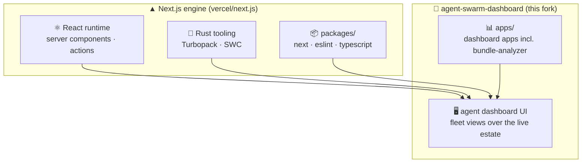

<div align="center">
  <a href="https://nextjs.org">
    <picture>
      <source media="(prefers-color-scheme: dark)" srcset="https://assets.vercel.com/image/upload/v1662130559/nextjs/Icon_dark_background.png">
      
    </picture>
  </a>
  <h1>agent-swarm-dashboard</h1>
  <p><strong>The React framework for the web — as toxicwind's working fork, powering the agent swarm dashboard.</strong></p>

<a href="https://vercel.com"></a>
<a href="https://www.npmjs.com/package/next"></a>
<a href="https://github.com/toxicwind/agent-dashboard"></a>
<a href="https://nextjs.org/discord"></a>

</div>

> 🧬 **toxicwind fork** — this is our working fork of [vercel/next.js](https://github.com/vercel/next.js), packaged as **`agent-swarm-dashboard` v1.0.0**. The full Next.js engine is intact; the fork is the UI layer for the agent fleet — dashboards over the live estate. All upstream docs, packages, and examples below apply as-is.

Used by some of the world's largest companies, Next.js lets you build full-stack web applications by extending the latest React features, with powerful Rust-based JavaScript tooling for the fastest builds.

---

## ✨ Features

- **Full-stack React** — server components, server actions, and streaming built in
- **Rust-powered tooling** — Turbopack for dev, optimized production builds
- **App + Pages routers** — two routing paradigms, one framework
- **Zero-config TypeScript** — type-safe from the first file
- **Fleet dashboards** *(fork layer)* — `agent-swarm-dashboard` builds the agent UI on this engine
- **Everything upstream** — `apps/`, `packages/`, `crates/`, examples, and evals from Next.js proper

---

## 🚀 Quick start

```bash
# 1. install dependencies (pnpm workspace)
pnpm install

# 2. start developing
pnpm dev

# 3. build for production
pnpm build
```

New to Next.js? Take the [Learn Next.js](https://nextjs.org/learn) course, browse the [Showcase](https://nextjs.org/showcase), and read the full [Documentation](https://nextjs.org/docs).

---

## 🔧 Architecture



The monorepo layout is upstream Next.js: `packages/` (the framework), `crates/` (Rust tooling), `apps/` (first-party apps), `examples/`, `docs/` (the 01-app / 02-pages / 03-architecture / 04-community guides), `bench/`, `evals/`, and `turbopack/`. The fork layer adds the `agent-swarm-dashboard` package (v1.0.0) and dashboard apps on top.

Key docs: [`docs/01-app`](docs/01-app) · [`docs/02-pages`](docs/02-pages) · [`docs/03-architecture`](docs/03-architecture) · [`docs/04-community`](docs/04-community) · [`UPGRADING.md`](UPGRADING.md) · [`contributing.md`](contributing.md)

---

## ⚙️ Config

Standard Next.js configuration applies — `next.config.*`, environment variables, and `vercel.json` for deployments. See the [Next.js docs](https://nextjs.org/docs) for the full reference.

Optional services: none required for local dev. Deploy targets (Vercel or self-hosted) are your choice.

---

## 🛠️ Dev

```bash
node run-tests.js       # run the test suite
node run-evals.js       # run evals
pnpm lint               # lint the workspace
```

Contributions are welcome and highly appreciated — but first review the [Contribution Guidelines](contributing.md). Newcomers: start with [**good first issues**](https://github.com/vercel/next.js/labels/good%20first%20issue). This fork tracks upstream `canary`; estate-specific UI work lands in the dashboard packages.

---

## 🧬 Related projects

| Repo | Role |
|---|---|
| [**codeflux**](https://github.com/toxicwind/codeflux) | live patch-streaming pipeline |
| [**codeflux-moulti**](https://github.com/toxicwind/codeflux-moulti) | TUI steps + `stream` subcommand |
| [**codeflux-patchling**](https://github.com/toxicwind/codeflux-patchling) | deterministic mutation backend |
| [**codeflux-python-patch**](https://github.com/toxicwind/codeflux-python-patch) | hunks-as-data + apply reports |
| [**codeflux-watchfiles**](https://github.com/toxicwind/codeflux-watchfiles) | structured file events |
| [**ast-grep**](https://github.com/toxicwind/ast-grep) | structural search satellite |

---

## 📄 License & security

**License:** MIT — inherited from the [Next.js upstream](https://github.com/vercel/next.js/blob/canary/license.md).

**Security:** if you believe you have found a security vulnerability, **responsibly disclose it — do NOT open a public issue.** This fork participates in the upstream Open Source Software Bug Bounty program: email [responsible.disclosure@vercel.com](mailto:responsible.disclosure@vercel.com) and you will be added to the program with further instructions. Our [Code of Conduct](CODE_OF_CONDUCT.md) applies to all community channels.
